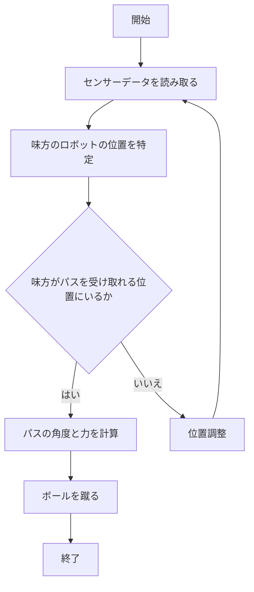

```mermaid
flowchart TD
    A[開始] --> B[センサーデータを読み取る]
    B --> C[味方のロボットの位置を特定]
    C --> D{味方がパスを受け取れる位置にいるか}
    D -- はい --> E[パスの角度と力を計算]
    E --> F[ボールを蹴る]
    F --> G[終了]
    D -- いいえ --> H[位置調整]
    H --> B
```
